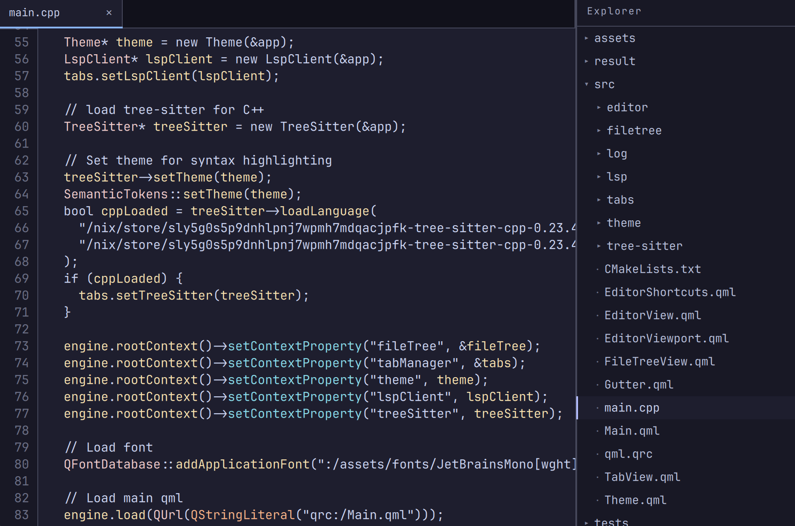
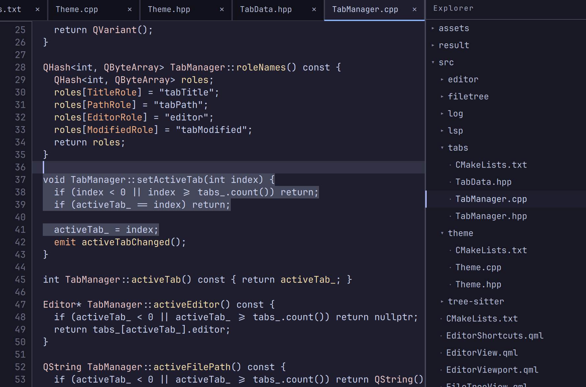
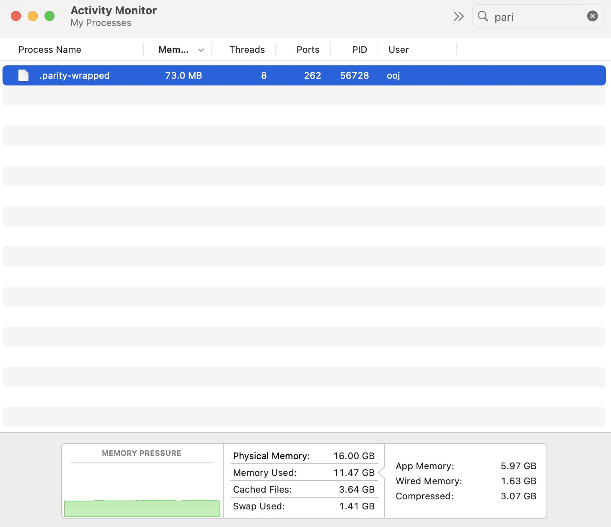
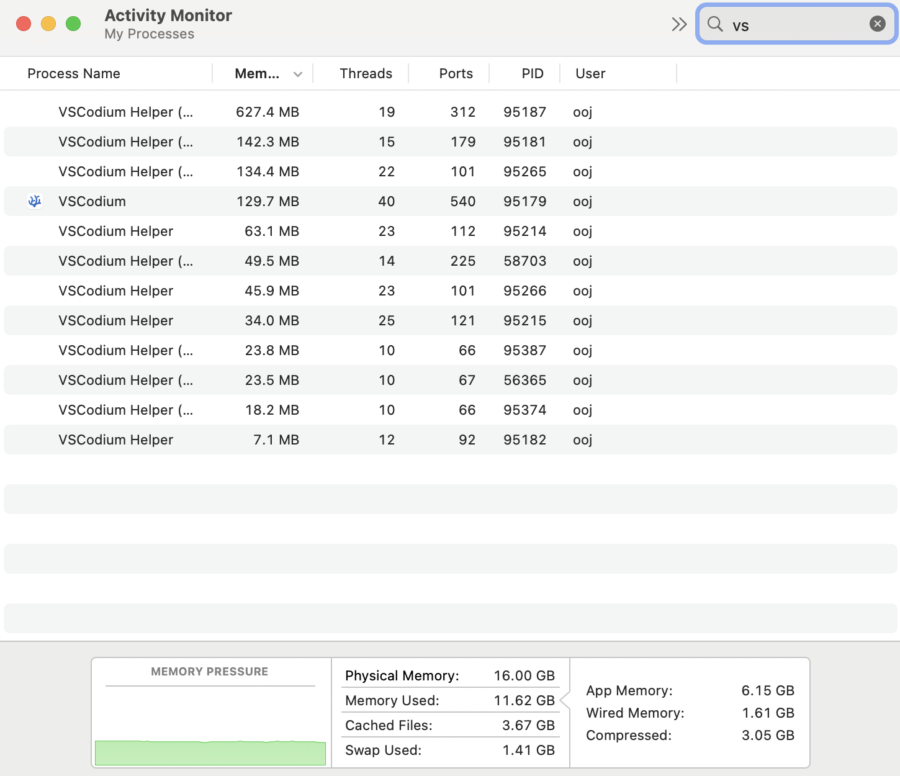

<h1 align="center">parity</h1>

  <i>Nix-backed IDE for fully reproducible development environments</i>

  Open a project and get <i>exactly</i> the tooling that project requires.

 

---

  
  

## Philosophy

Development environments should be part of the codebase.

`parity` uses Nix to build hermetic, project-specific IDEs. Every developer, CI runner, and AI agent gets the same tools, the same versions, and the same behavior.

Whether you're working in a small repository or a massive polyglot monorepo, everyone and their agents can operate from the same environment.

The goal is simple:

- Complete parity across teams
- Reproducible development environments
- Zero global dependencies
- Fast local workflows
- Minimal operational overhead

 

---

## Why parity?

Most modern IDEs are built on Chromium and JavaScript stacks, but `parity` isn't.

It's written in modern C++ and Qt6/QtQuick, with a focus on speed, efficiency, and keeping resource usage predictable.

On average, it uses <100MB of memory across <12 threads, whereas VSCode uses >1GB of memory across >200 threads!

  
  

The editor is native, cross-platform, and designed around a minimal core rather than an ever-growing plugin ecosystem.

Features are added because they're necessary, not because they're fashionable.

 

---

## What You Get

<table>
  <tr>
    <td>Hermetic development environments built from Nix</td>
    <td>Project-provided languages, SDKs, and runtimes</td>
  </tr>
  <tr>
    <td>Project-provided LSPs, formatters, and linters</td>
    <td>Consistent tooling across dev, CI, and AI agents</td>
  </tr>
  <tr>
    <td>Native C++ and Qt6 implementation</td>
    <td>Cross-platform support</td>
  </tr>
  <tr>
    <td>Fast startup and low resource usage</td>
    <td>Minimal, focused UI</td>
  </tr>
  <tr>
    <td>No global dependency drift</td>
    <td>Fully reproducible environments</td>
  </tr>
</table>

 
